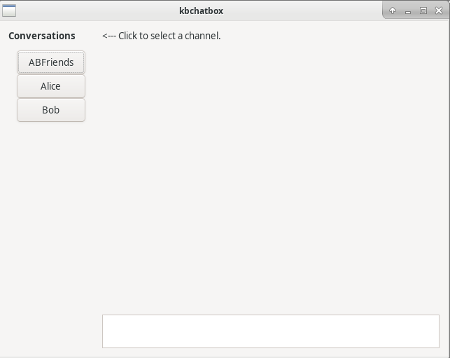

# kbchatbox - Lightweight Keybase chat client [](https://travis-ci.com/ndob/kbchatbox)

Regular Keybase GUI is fairly resource intensive as it uses Electron. This is a simple front end for the chat API that is accessible from the command line.



## Building

```
cargo build --release
```

## Running

Dependencies:
- libui
- Keybase command line client (https://keybase.io/download)

Tested on Arch Linux only, but in theory should be possible to run on platforms that libUI supports.

## Running tests
```
cargo test
```

## TODO
- [ ] Fix API thread closing
- [ ] Notification related code from keybase.rs to main.

## Useful info

https://github.com/keybase/keybase-bot/blob/master/src/chat-client/index.ts
